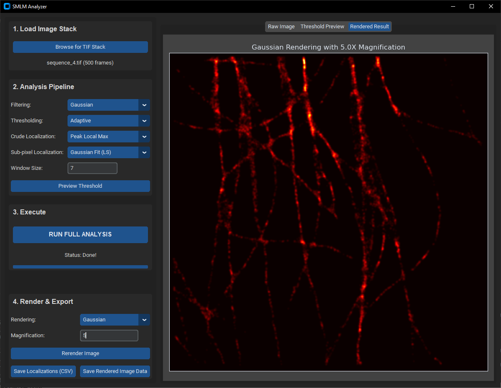

# SMLM_localizer

This is the Git repository for a program I developed for image reconstruction in a STORM based super resolution microscope as a part of my PhD.

## Setting up

The program was developed in Python 3.12.7. Later versions of Python should be supported but have not been tested yet.
If you are on a later version, give it a try!

I would suggest you use [Anaconda](https://www.anaconda.com/download/success) / Miniconda and set up a virtual environment as:

- conda create -n "myenv" python=3.12.7 # replace "myenv" with your desired name.

After setting up the virtual environment, you can install the dependencies as:

- pip install -r requirements.txt

## Usage

Run the script main.py to call up the GUI, which looks like this .
1. Browse the image by clicking on 'Browse for TIF stack'.
2. Select the filtering method from the dropdown 'Filtering'.
3. Select the thresholding method from the dropdown 'Threshold'.
4. Preview the thresholded image
5. Select the PSF detection method from the dropdown 'Crude Localization'.
6. Select the sub pixel localization method from the dropdown 'Sub-Pixel Localization'.
7. Type in Window size (in pixels).
8. Type in the rendering Magnification. 
9. Cick on 'Run Full Analysis' button to process the images.
10. Save the dataset csv and the output image by pressing 'Save Localizations (CSV)' and 'Save Rendered Image Data' buttons.

Thank you,

Pranjal Choudhury
