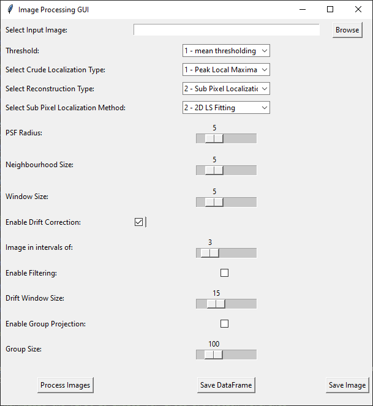

# SMLM_localizer

This is the Git repository for a program I developed for image reconstruction in a STORM based super resolution microscope as a part of my PhD.

## Setting up

The program was developed in Python 3.8.8. Later versions of Python should be supported but have not been tested yet.
If you are on a later version, give it a try!

I would suggest you use [Anaconda](https://www.anaconda.com/download/success) / Miniconda and set up a virtual environment as:

- conda create -n "myenv" python=3.8.8 # replace "myenv" with your desired name.

After setting up the virtual environment, you can install the dependencies as:

- pip install -r requirements.txt

## Usage

1. Run the script _GUI_main.py_ to call up the GUI, which looks like .
2. browse the image stack.
3. select the thresholding method from the dropdown 'Threshold'.
4. select the PSF detection method from the dropdown 'Select Crude Localization Type'.
5. select the reconstruction type from the dropdown 'Select Reconstruction Type'.
6. select the sub pixel localization method from the dropdown 'Select Sub Pixel Localization Method'.
7. choose the PSF radius, Neighbourhood size and Window size using the sliders.
8. cick on 'Process images' button to process the images.
9. save the dataset csv and the output image by pressing 'Save DataFrame' and 'Save Image' buttons.

Thank you,

Pranjal Choudhury
